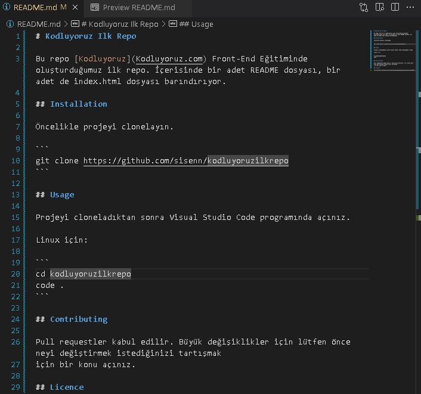

# Kodluyoruz Ilk Repo

Bu repo [Kodluyoruz](Kodluyoruz.com) Front-End Eğitiminde oluşturduğumuz ilk repo. İçerisinde bir adet README dosyası, bir adet de index.html dosyası barındırıyor.



## Installation

Öncelikle projeyi clonelayın. (Buraya sizin reponuzdan aldığınız link gelecek.)

```
git clone https://github.com/sisenn/kodluyoruzilkrepo
```

## Usage

Projeyi cloneladıktan sonra Visual Studio Code programında açınız.

Linux için:

```
cd kodluyoruzilkrepo
code .
```

## Contributing

Pull requestler kabul edilir. Büyük değişiklikler için lütfen önce neyi değiştirmek istediğinizi tartışmak
için bir konu açınız. 

## Licence

[MIT](https://github.com/sisenn/kodluyoruzilkrepo/blob/main/LICENSE)